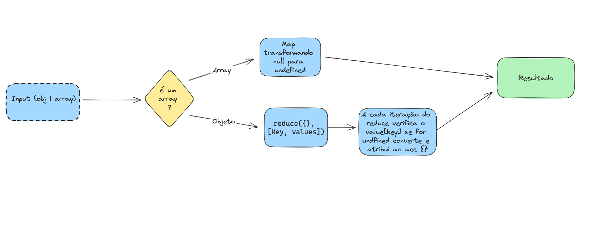
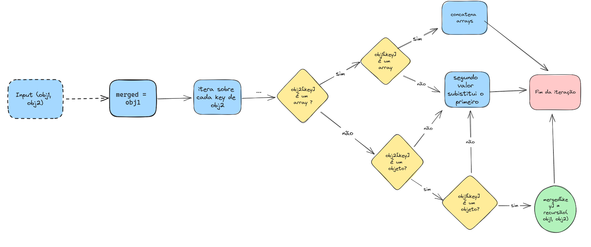
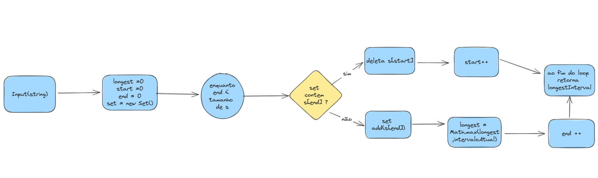

# Nuvidio
Processo seletivo da Nuvidio

Todas as questões possuem testes unitários cobrindo as principais possibilidades, basta rodar o comando yarn test <pre>
```bash
# Comando para rodar testes unitários
yarn run test
```
## Questão 1

Escreva uma função undefinedToNull que recebe um objeto ou array de objetos e
cria uma cópia do objeto ou array substituindo todos os undefined por null

### Fluxograma da Resposta



## Questão 2 

Escreva uma função que faça a mesclagem de dois objetos, e em caso de
propriedades conflitantes, avaliar a possibilidade de mesclagem (arrays ou objetos
aninhados). Se não for possível, o segundo objeto deve substituir o primeiro

### Fluxograma da Resposta



## Questão 3 

Dado uma string qualquer, procure o tamanho da maior substring sem caracteres
repetidos

### Fluxograma da Resposta 

 